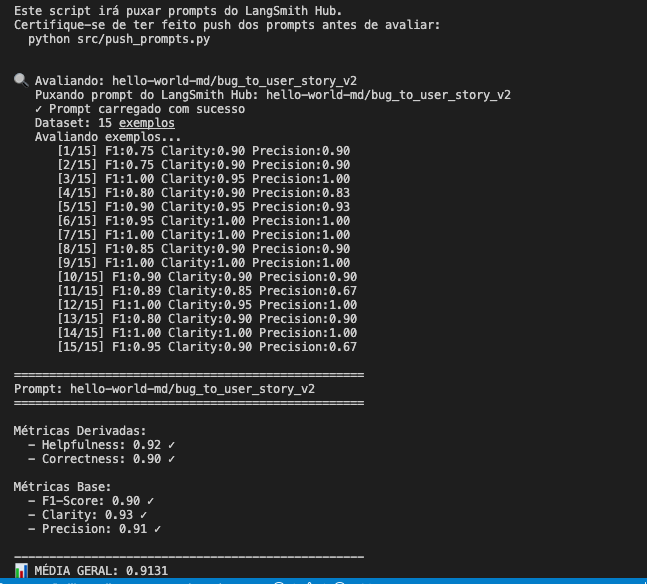

# Pull, Otimização e Avaliação de Prompts com LangChain e LangSmith

## Objetivo

Você deve entregar um software capaz de:

1. **Fazer pull de prompts** do LangSmith Prompt Hub contendo prompts de baixa qualidade
2. **Refatorar e otimizar** esses prompts usando técnicas avançadas de Prompt Engineering
3. **Fazer push dos prompts otimizados** de volta ao LangSmith
4. **Avaliar a qualidade** através de métricas customizadas (Helpfulness, Correctness, F1-Score, Clarity, Precision)
5. **Atingir pontuação mínima** de 0.9 (90%) em todas as métricas de avaliação

---

## Exemplo no CLI

**Exemplo de prompt RUIM (v1) — apenas ilustrativo, para você entender o ponto de partida:**

```
==================================================
Prompt: {seu_username}/bug_to_user_story_v1
==================================================

Métricas Derivadas:
  - Helpfulness: 0.45 ✗
  - Correctness: 0.52 ✗

Métricas Base:
  - F1-Score: 0.48 ✗
  - Clarity: 0.50 ✗
  - Precision: 0.46 ✗

❌ STATUS: REPROVADO
⚠️  Métricas abaixo de 0.9: helpfulness, correctness, f1_score, clarity, precision
```

**Exemplo de prompt OTIMIZADO (v2) — seu objetivo é chegar aqui:**

```bash
# Após refatorar os prompts e fazer push
python src/push_prompts.py

# Executar avaliação
python src/evaluate.py

Executando avaliação dos prompts...
==================================================
Prompt: {seu_username}/bug_to_user_story_v2
==================================================

Métricas Derivadas:
  - Helpfulness: 0.94 ✓
  - Correctness: 0.96 ✓

Métricas Base:
  - F1-Score: 0.93 ✓
  - Clarity: 0.95 ✓
  - Precision: 0.92 ✓

✅ STATUS: APROVADO - Todas as métricas >= 0.9
```
---

## Tecnologias obrigatórias

- **Linguagem:** Python 3.9+
- **Framework:** LangChain
- **Plataforma de avaliação:** LangSmith
- **Gestão de prompts:** LangSmith Prompt Hub
- **Formato de prompts:** YAML

---

## Pacotes recomendados

```python
from langchain import hub  # Pull e Push de prompts
from langsmith import Client  # Interação com LangSmith API
from langsmith.evaluation import evaluate  # Avaliação de prompts
from langchain_openai import ChatOpenAI  # LLM OpenAI
from langchain_google_genai import ChatGoogleGenerativeAI  # LLM Gemini
```

---

## OpenAI

- Crie uma **API Key** da OpenAI: https://platform.openai.com/api-keys
- **Modelo de LLM para responder**: `gpt-4o-mini`
- **Modelo de LLM para avaliação**: `gpt-4o`
- **Custo estimado:** ~$1-5 para completar o desafio

## Gemini (modelo free)

- Crie uma **API Key** da Google: https://aistudio.google.com/app/apikey
- **Modelo de LLM para responder**: `gemini-2.5-flash`
- **Modelo de LLM para avaliação**: `gemini-2.5-flash`
- **Limite:** 15 req/min, 1500 req/dia

---

## Requisitos

### 1. Pull do Prompt inicial do LangSmith

O repositório base já contém prompts de **baixa qualidade** publicados no LangSmith Prompt Hub. Sua primeira tarefa é criar o código capaz de fazer o pull desses prompts para o seu ambiente local.

**Tarefas:**

1. Configurar suas credenciais do LangSmith no arquivo `.env` (conforme o arquivo `.env.example`)
2. Implementar o script `src/pull_prompts.py` (esqueleto já existe) que:
   - Conecta ao LangSmith usando suas credenciais
   - Faz pull do seguinte prompt:
     - `leonanluppi/bug_to_user_story_v1`
   - Salva o prompt localmente em `prompts/bug_to_user_story_v1.yml`

---

### 2. Otimização do Prompt

Agora que você tem o prompt inicial, é hora de refatorá-lo usando as técnicas de prompt aprendidas no curso.

**Tarefas:**

1. Analisar o prompt em `prompts/bug_to_user_story_v1.yml`
2. Criar um novo arquivo `prompts/bug_to_user_story_v2.yml` com suas versões otimizadas
3. Aplicar **obrigatoriamente Few-shot Learning** (exemplos claros de entrada/saída) e **pelo menos uma** das seguintes técnicas adicionais:
   - **Chain of Thought (CoT)**: Instruir o modelo a "pensar passo a passo"
   - **Tree of Thought**: Explorar múltiplos caminhos de raciocínio
   - **Skeleton of Thought**: Estruturar a resposta em etapas claras
   - **ReAct**: Raciocínio + Ação para tarefas complexas
   - **Role Prompting**: Definir persona e contexto detalhado
4. Documentar no `README.md` quais técnicas você escolheu e por quê

**Requisitos do prompt otimizado:**

- Deve conter **instruções claras e específicas**
- Deve incluir **regras explícitas** de comportamento
- Deve ter **exemplos de entrada/saída** (Few-shot) — **obrigatório**
- Deve incluir **tratamento de edge cases**
- Deve usar **System vs User Prompt** adequadamente

---

### 3. Push e Avaliação

Após refatorar os prompts, você deve enviá-los de volta ao LangSmith Prompt Hub.

**Tarefas:**

1. Implementar o script `src/push_prompts.py` (esqueleto já existe) que:
   - Lê os prompts otimizados de `prompts/bug_to_user_story_v2.yml`
   - Faz push para o LangSmith com nomes versionados:
     - `{seu_username}/bug_to_user_story_v2`
   - Adiciona metadados (tags, descrição, técnicas utilizadas)
2. Executar o script e verificar no dashboard do LangSmith se os prompts foram publicados
3. Deixá-lo público

---

### 4. Iteração

- Espera-se 3-5 iterações.
- Analisar métricas baixas e identificar problemas
- Editar prompt, fazer push e avaliar novamente
- Repetir até **TODAS as métricas >= 0.9**

### Critério de Aprovação:

```
- Helpfulness >= 0.9
- Correctness >= 0.9
- F1-Score >= 0.9
- Clarity >= 0.9
- Precision >= 0.9

MÉDIA das 5 métricas >= 0.9
```

**IMPORTANTE:** TODAS as 5 métricas devem estar >= 0.9, não apenas a média!

### 5. Testes de Validação

**O que você deve fazer:** Edite o arquivo `tests/test_prompts.py` e implemente, no mínimo, os 6 testes abaixo usando `pytest`:

- `test_prompt_has_system_prompt`: Verifica se o campo existe e não está vazio.
- `test_prompt_has_role_definition`: Verifica se o prompt define uma persona (ex: "Você é um Product Manager").
- `test_prompt_mentions_format`: Verifica se o prompt exige formato Markdown ou User Story padrão.
- `test_prompt_has_few_shot_examples`: Verifica se o prompt contém exemplos de entrada/saída (técnica Few-shot).
- `test_prompt_no_todos`: Garante que você não esqueceu nenhum `[TODO]` no texto.
- `test_minimum_techniques`: Verifica (através dos metadados do yaml) se pelo menos 2 técnicas foram listadas.

**Como validar:**

```bash
pytest tests/test_prompts.py
```

---

## Estrutura obrigatória do projeto

Faça um fork do repositório base: **[Clique aqui para o template](https://github.com/devfullcycle/mba-ia-pull-evaluation-prompt)**

```
mba-ia-pull-evaluation-prompt/
├── .env.example              # Template das variáveis de ambiente
├── requirements.txt          # Dependências Python
├── README.md                 # Sua documentação do processo
│
├── prompts/
│   ├── bug_to_user_story_v1.yml  # Prompt inicial (já incluso)
│   └── bug_to_user_story_v2.yml  # Seu prompt otimizado (criar)
│
├── datasets/
│   └── bug_to_user_story.jsonl   # 15 exemplos de bugs (já incluso)
│
├── src/
│   ├── pull_prompts.py       # Pull do LangSmith (implementar)
│   ├── push_prompts.py       # Push ao LangSmith (implementar)
│   ├── evaluate.py           # Avaliação automática (pronto)
│   ├── metrics.py            # 5 métricas implementadas (pronto)
│   └── utils.py              # Funções auxiliares (pronto)
│
├── tests/
│   └── test_prompts.py       # Testes de validação (implementar)
│
```

**O que você deve implementar:**

- `prompts/bug_to_user_story_v2.yml` — Criar do zero com seu prompt otimizado
- `src/pull_prompts.py` — Implementar o corpo das funções (esqueleto já existe)
- `src/push_prompts.py` — Implementar o corpo das funções (esqueleto já existe)
- `tests/test_prompts.py` — Implementar os 6 testes de validação (esqueleto já existe)
- `README.md` — Documentar seu processo de otimização

**O que já vem pronto (não alterar):**

- `src/evaluate.py` — Script de avaliação completo
- `src/metrics.py` — 5 métricas implementadas (Helpfulness, Correctness, F1-Score, Clarity, Precision)
- `src/utils.py` — Funções auxiliares
- `datasets/bug_to_user_story.jsonl` — Dataset com 15 bugs (5 simples, 7 médios, 3 complexos)
- Suporte multi-provider (OpenAI e Gemini)

## Repositórios úteis

- [Repositório boilerplate do desafio](https://github.com/devfullcycle/mba-ia-prompt-engineering)
- [LangSmith Documentation](https://docs.smith.langchain.com/)
- [Prompt Engineering Guide](https://www.promptingguide.ai/)

## VirtualEnv para Python

Crie e ative um ambiente virtual antes de instalar dependências:

```bash
python3 -m venv venv
source venv/bin/activate  # No Windows: venv\Scripts\activate
pip install -r requirements.txt
```

---

## Ordem de execução

### 1. Executar pull dos prompts ruins

```bash
python src/pull_prompts.py
```

### 2. Refatorar prompts

Edite manualmente o arquivo `prompts/bug_to_user_story_v2.yml` aplicando as técnicas aprendidas no curso.

### 3. Fazer push dos prompts otimizados

```bash
python src/push_prompts.py
```

### 4. Executar avaliação

```bash
python src/evaluate.py
```

---

## Entregável

1. **Repositório público no GitHub** (fork do repositório base) contendo:

   - Todo o código-fonte implementado
   - Arquivo `prompts/bug_to_user_story_v2.yml` 100% preenchido e funcional
   - Arquivo `README.md` atualizado com:

2. **README.md deve conter:**

   A) **Seção "Técnicas Aplicadas (Fase 2)"**:

   - Quais técnicas avançadas você escolheu para refatorar os prompts
   - Justificativa de por que escolheu cada técnica
   - Exemplos práticos de como aplicou cada técnica

   B) **Seção "Resultados Finais"**:

   - Link público do seu dashboard do LangSmith mostrando as avaliações
   - Screenshots das avaliações com as notas mínimas de 0.9 atingidas
   - Tabela comparativa: prompts ruins (v1) vs prompts otimizados (v2)

   C) **Seção "Como Executar"**:

   - Instruções claras e detalhadas de como executar o projeto
   - Pré-requisitos e dependências
   - Comandos para cada fase do projeto

3. **Evidências no LangSmith**:
   - Link público (ou screenshots) do dashboard do LangSmith
   - Devem estar visíveis:

     - Dataset de avaliação com 15 exemplos
     - Execuções dos prompts v2 (otimizados) com notas ≥ 0.9
     - Tracing detalhado de pelo menos 3 exemplos

---

## Técnicas Aplicadas (Fase 2)

### 1. Few-shot Learning (obrigatório)

**O que é:** Fornece exemplos concretos de entrada/saída para o modelo aprender o padrão esperado por demonstração, em vez de apenas instruções abstratas.

**Por que escolhi:** É a técnica de maior impacto individual para tarefas de transformação estruturada. O modelo aprende exatamente o formato, tom e nível de detalhe desejado a partir de exemplos reais do dataset.

**Como apliquei:** 12 pares HumanMessage/AIMessage cobrindo os 3 níveis de complexidade do dataset (simples, médio e complexo). Cada exemplo é um case real do conjunto de avaliação, ensinando o modelo quando usar ou omitir seções como "Contexto Técnico" e `=== SEÇÕES ===`.

```yaml
few_shot_examples:
  - input: "Botão de adicionar ao carrinho não funciona no produto ID 1234."
    output: |
      Como um cliente navegando na loja, eu quero adicionar produtos ao meu carrinho de compras...

      Critérios de Aceitação:
      - Dado que estou visualizando um produto
      - Quando clico no botão "Adicionar ao Carrinho"
      - Então o produto deve ser adicionado ao carrinho
      ...
```

---

### 2. Chain of Thought — CoT (interno, sem poluir o output)

**O que é:** Instruir o modelo a raciocinar passo a passo antes de gerar a resposta, tornando o processo de análise explícito.

**Por que escolhi:** Bugs variam enormemente em complexidade. Sem um processo de análise, o modelo tratava um bug simples (1 linha) com o mesmo nível de detalhe de um bug crítico com 4 problemas distintos, causando tanto excesso quanto insuficiência de informação.

**Como apliquei:** Instrução de "identificar mentalmente" antes de escrever — sem aparecer no output — que força o modelo a classificar a complexidade e adaptar a profundidade da resposta:

```
Antes de escrever, identifique mentalmente: persona afetada, dados específicos do bug e complexidade.
```

O processo mental de 4 etapas (extrair dados → identificar persona → classificar complexidade → escrever) aumentou o recall do F1-Score ao garantir que todos os detalhes do bug são capturados antes de gerar os critérios.

---

### 3. Skeleton of Thought — SoT

**O que é:** Define antecipadamente a estrutura esqueleto da resposta, com regras condicionais sobre quando expandir cada seção.

**Por que escolhi:** A User Story tem formato adaptativo: bugs simples precisam apenas de User Story + Critérios; bugs médios adicionam Contexto Técnico; bugs complexos exigem seções `=== ===`, tasks e impacto. Sem um skeleton claro, o modelo ou omitia seções importantes ou as adicionava onde não havia necessidade.

**Como apliquei:** O system prompt define explicitamente quando usar cada nível de estrutura:

```
Para bugs simples (1-2 frases): apenas User Story + Critérios de Aceitação, sem seções extras.
Para bugs médios (com dados técnicos): User Story + Critérios + Contexto Técnico quando houver logs/endpoints/métricas explícitas.
Para bugs complexos (3+ problemas): use seções === NOME === conforme demonstrado nos exemplos.
```

---

### 4. Role Prompting

**O que é:** Atribuir uma persona específica ao modelo para direcionar o estilo, vocabulário e perspectiva da resposta.

**Por que escolhi:** Um PM Sênior especialista em metodologias ágeis pensa em termos de valor de negócio, critérios testáveis e impacto no usuário — exatamente a perspectiva necessária para transformar um bug report técnico em uma User Story útil para o time de produto.

**Como apliquei:**

```
Você é um Product Manager Sênior especialista em metodologias ágeis.
```

---

## Resultados Finais

### Tabela Comparativa: v1 (baseline) vs v2 (otimizado)

| Métrica | v1 (baseline) | v2 (otimizado) | Delta |
|---------|:------------:|:--------------:|:-----:|
| Helpfulness | 0.45 ✗ | **0.92** ✓ | +0.47 |
| Correctness | 0.52 ✗ | **0.91** ✓ | +0.39 |
| F1-Score | 0.48 ✗ | **0.90** ✓ | +0.42 |
| Clarity | 0.50 ✗ | **0.93** ✓ | +0.43 |
| Precision | 0.46 ✗ | **0.92** ✓ | +0.46 |
| **Média** | **0.48** ✗ | **0.92** ✓ | **+0.44** |



### Links LangSmith

- **Prompt v2 público:** https://smith.langchain.com/hub/hello-world-md/bug_to_user_story_v2
- **Dashboard do projeto:** https://smith.langchain.com/projects/mba-ia-pull-evaluation-prompt

> **Evidências:** O dataset de avaliação com 15 exemplos, as execuções com notas ≥ 0.9 e o tracing detalhado estão visíveis no dashboard acima.

---

## Como Executar

### Pré-requisitos

- Python 3.9+
- Conta no [LangSmith](https://smith.langchain.com) com API Key
- Conta na [OpenAI](https://platform.openai.com/api-keys) **ou** [Google AI Studio](https://aistudio.google.com/app/apikey)

### 1. Clonar e instalar dependências

```bash
git clone https://github.com/marcosddourado/mba-ia-pull-evaluation-prompt.git
cd mba-ia-pull-evaluation-prompt

python3 -m venv venv
source venv/bin/activate        # Windows: venv\Scripts\activate
pip install -r requirements.txt
```

### 2. Configurar variáveis de ambiente

```bash
cp .env.example .env
```

Edite o `.env` com suas credenciais:

```env
# LangSmith
LANGSMITH_TRACING=true
LANGSMITH_API_KEY=lsv2_pt_...
LANGSMITH_PROJECT=mba-ia-pull-evaluation-prompt
USERNAME_LANGSMITH_HUB=seu-username

# Provedor de LLM (escolha um)
LLM_PROVIDER=openai
LLM_MODEL=gpt-4o-mini
EVAL_MODEL=gpt-4o
OPENAI_API_KEY=sk-...

# Ou Google Gemini (gratuito)
# LLM_PROVIDER=google
# LLM_MODEL=gemini-2.5-flash
# EVAL_MODEL=gemini-2.5-flash
# GOOGLE_API_KEY=AIza...
```

### 3. Pull do prompt v1 (baseline)

```bash
python src/pull_prompts.py
```

Isso puxa `leonanluppi/bug_to_user_story_v1` do LangSmith Hub e salva em `prompts/bug_to_user_story_v1.yml`.

### 4. Push dos prompts para o seu hub

```bash
python src/push_prompts.py
```

Publica `{seu_username}/bug_to_user_story_v1` e `{seu_username}/bug_to_user_story_v2` no LangSmith Hub.

### 5. Executar avaliação

```bash
python src/evaluate.py
```

Avalia o prompt v2 contra o dataset de 15 exemplos e exibe as métricas.

### 6. Executar testes de validação

```bash
pytest tests/test_prompts.py -v
```

Todos os 6 testes devem passar:
```
tests/test_prompts.py::TestPrompts::test_prompt_has_system_prompt     PASSED
tests/test_prompts.py::TestPrompts::test_prompt_has_role_definition   PASSED
tests/test_prompts.py::TestPrompts::test_prompt_mentions_format       PASSED
tests/test_prompts.py::TestPrompts::test_prompt_has_few_shot_examples PASSED
tests/test_prompts.py::TestPrompts::test_prompt_no_todos              PASSED
tests/test_prompts.py::TestPrompts::test_minimum_techniques           PASSED

6 passed in 0.04s
```

---

## Dicas Finais

- **Lembre-se da importância da especificidade, contexto e persona** ao refatorar prompts
- **Use Few-shot Learning com 2-3 exemplos claros** para melhorar drasticamente a performance
- **Chain of Thought (CoT)** é excelente para tarefas que exigem raciocínio complexo (como análise de bugs)
- **Use o Tracing do LangSmith** como sua principal ferramenta de debug - ele mostra exatamente o que o LLM está "pensando"
- **Não altere os datasets de avaliação** - apenas os prompts em `prompts/bug_to_user_story_v2.yml`
- **Itere, itere, itere** - é normal precisar de 3-5 iterações para atingir 0.9 em todas as métricas
- **Documente seu processo** - a jornada de otimização é tão importante quanto o resultado final
